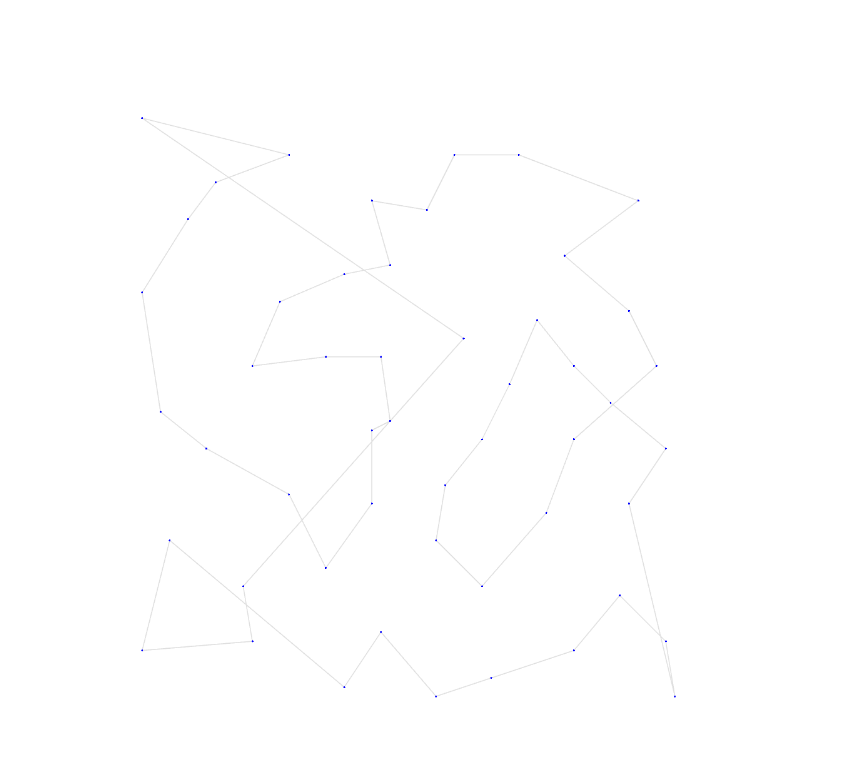
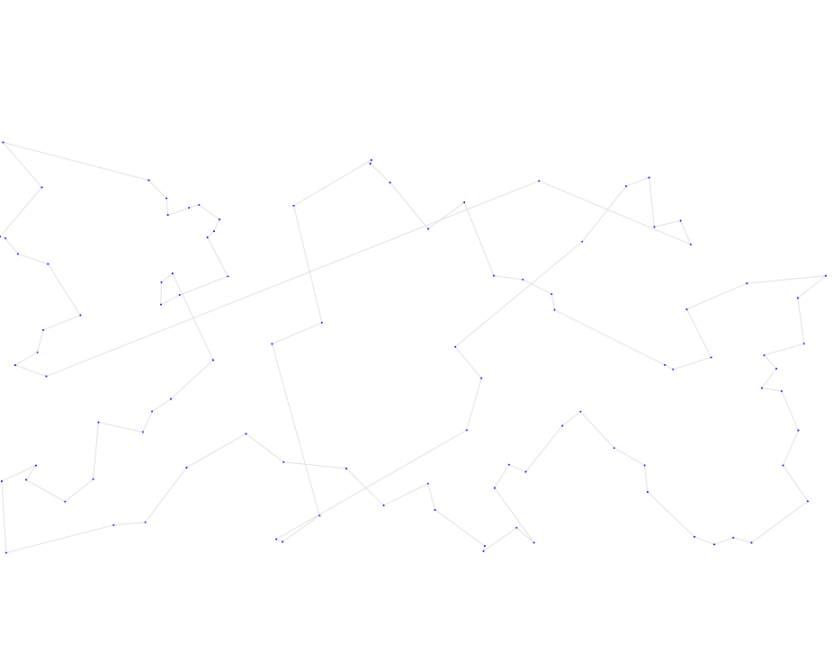
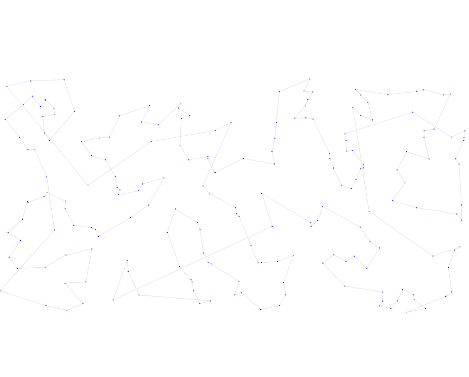
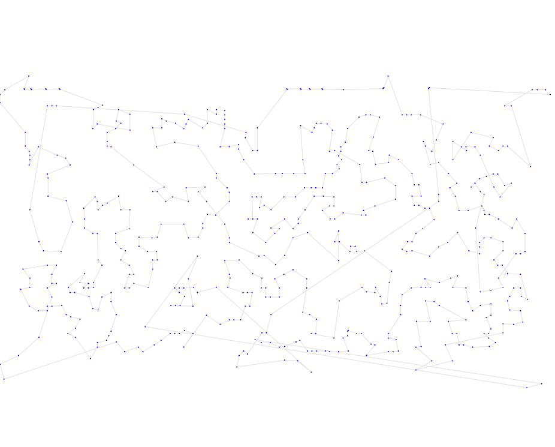
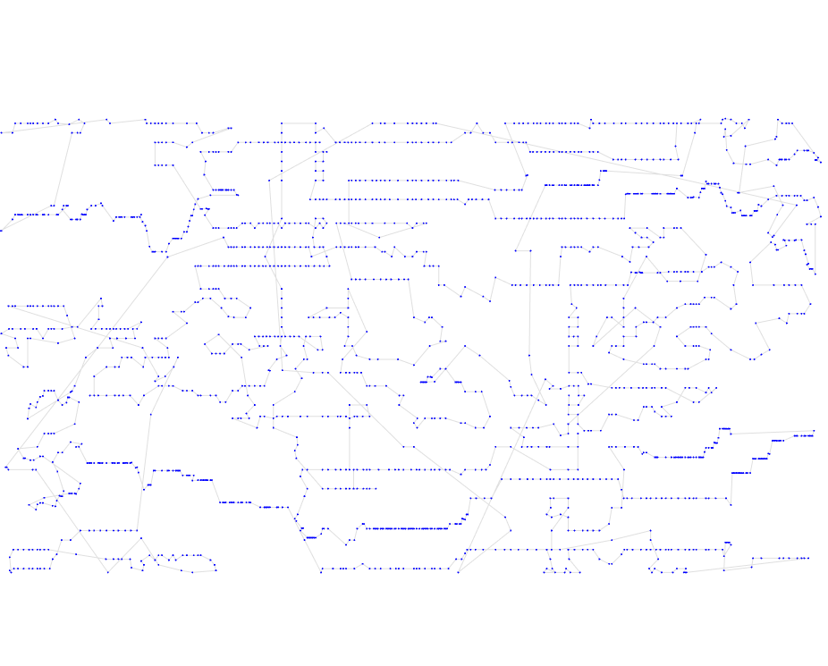
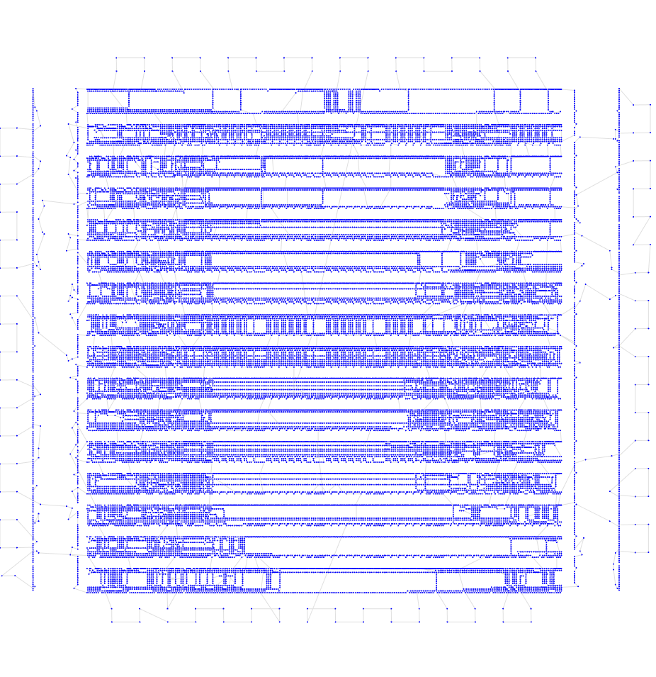

# Первая итерация

## Описание идеи
Для начала попробуем написать обычный жадный алгоритм и проверим как он работает. Просто будем идти по точкам, высчитывать расстояния до ближайшей непосещенной и переходить к ней. Алгоритм не возвращается назад и не пересчитывает сделанные решения.

Время работы получается O(n^2)

## Результат работы

Опишу результат на 6 тестовых выборках

| Набор данных | Длина пути | Визуализация |
| :--- | :--- | :--- |
| **tsp_51_1** | **506.36** |  |
| **tsp_100_3** | **25138.78** |  |
| **tsp_200_2** | **36226.22** |  |
| **tsp_574_1** | **47054.94** |  |
| **tsp_1889_1** | **391470.44** |  |
| **tsp_33810_1** | **73687535.45** |  |

## Итог

Можно видеть, что результаты лучше, чем случайный путь. Но много где не оптимально - мы никогда не пересчитываем предыдущие шаги, а поэтому под конец алгоритма расстояния до точек могут быть очень большими. То есть алгоритм не учитывает ситуации, когда выгодно идти не в самую близкую точку на конкретном шаге, но что сделает сильное уменьшение расстояния всего пути.

Из задания порог даже в 3 балла не проходится нигде, кроме последнего теста - там попадаем ровно в границу на 3 балла. 