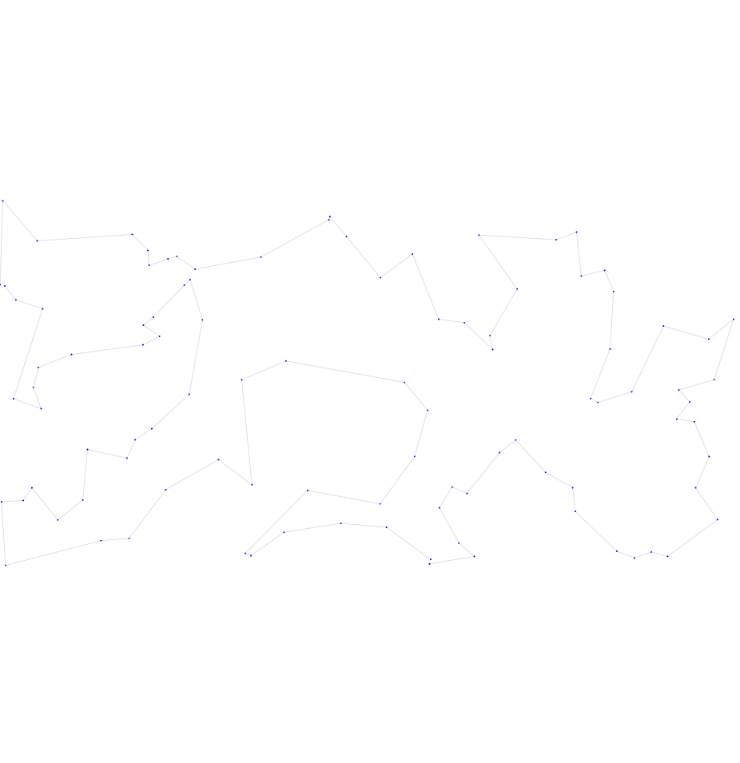
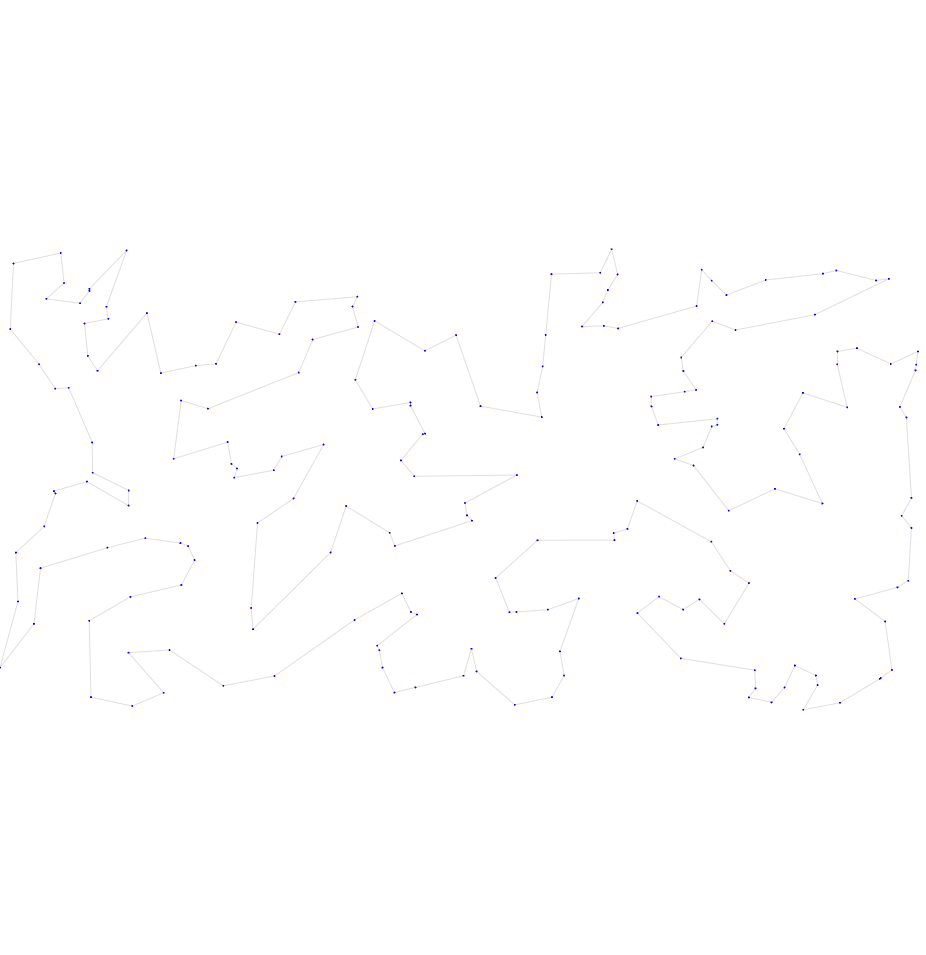
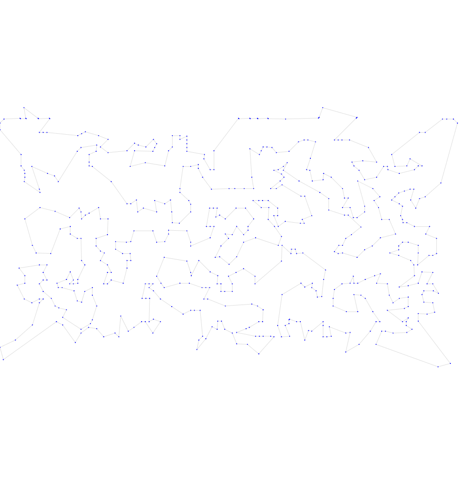
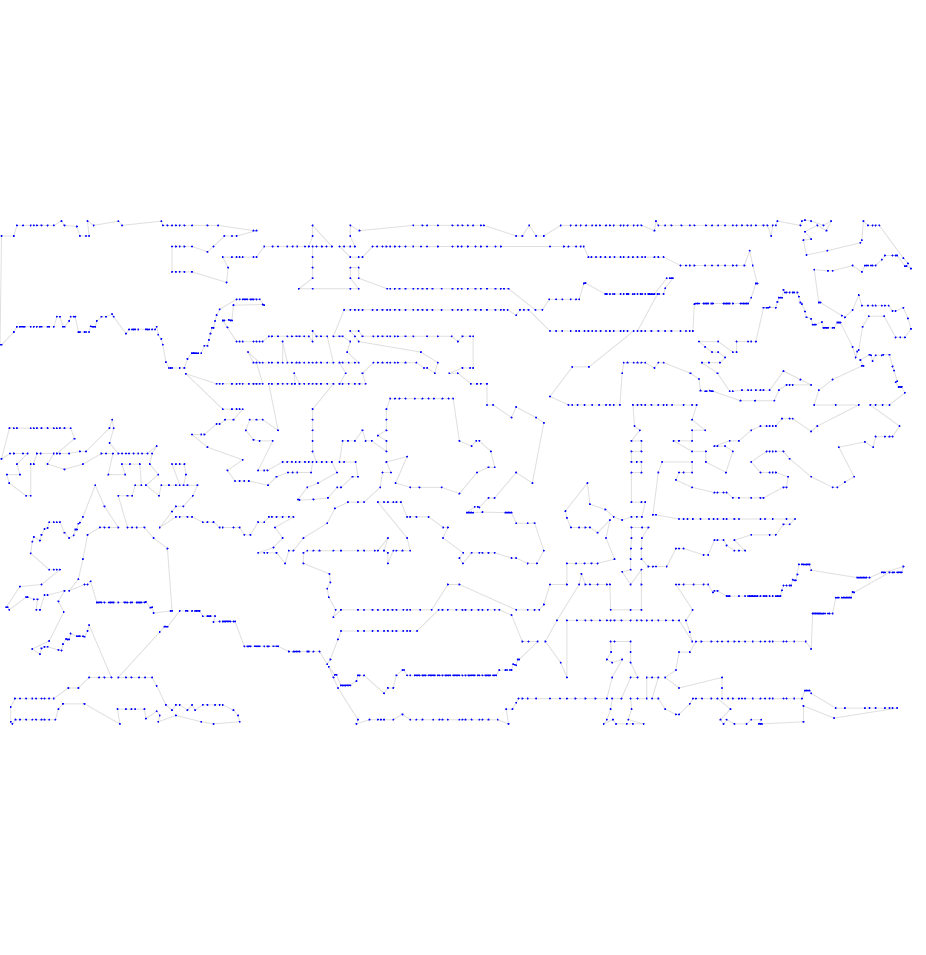
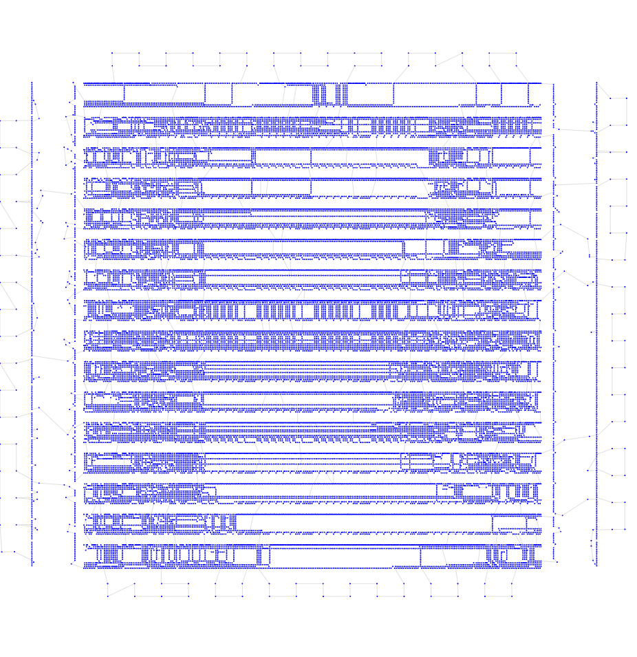

# Вторая итерация

## Описание идеи
Наложим на итог жадного алгоритма 2-opt. Алгоритм перебирает все пары ребер, и если их замена на два других ребра наперекрест уменьшает общую длину маршрута, переворачивает кусок пути между этими ребрами. Повторяем пока можем улучшить.

## Результат работы

Опишу результат на 6 тестовых выборках

| Набор данных | Длина пути | Визуализация |
| :--- | :--- | :--- |
| **tsp_51_1** | **449.01** |  |
| **tsp_100_3** | **21904.17** |  |
| **tsp_200_2** | **31485.49** |  |
| **tsp_574_1** | **39674.88** |  |
| **tsp_1889_1** | **340905.46** |  |
| **tsp_33810_1** | **70891883.69** |  |

## Итог

Результаты заметно улучшились по сравнению с чистым жадным алгоритмом.
Для всех тестов пройдены пороги в 3 балла, но пороги в 5 баллов пока не достигнуты нигде.
На последнем тесте время работы ~4,5 минуты.

