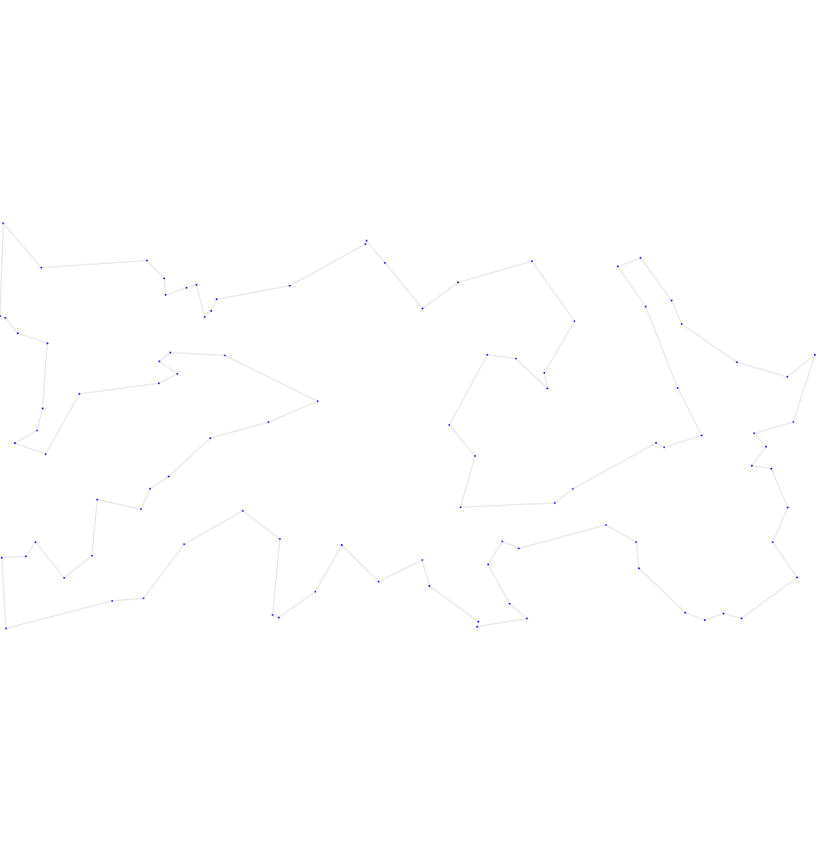
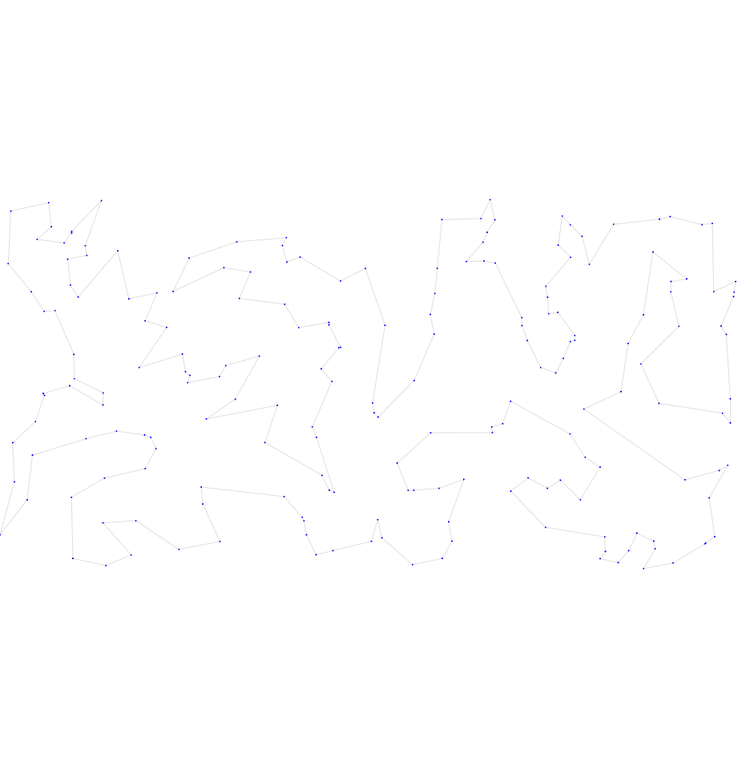
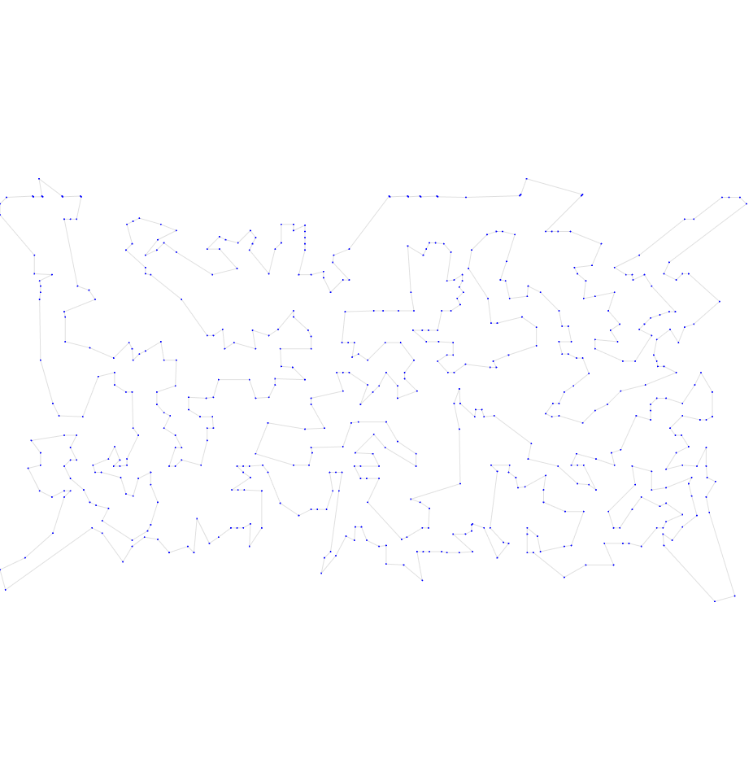
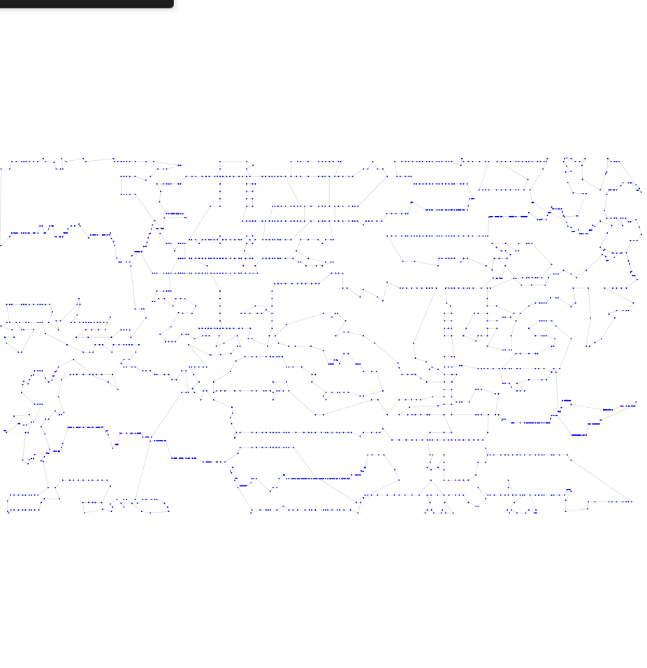
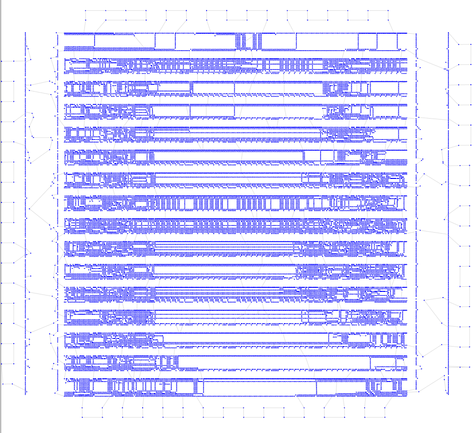

# Третья итерация

## Описание идеи
У нас все улучшения идут от изначально выбранного жадного алгоритма. Можно попробовать сделать запуск жадного алгоритма из разных точек, а на лучшем результате запустить оптимизацию 2-opt. Проверим как изменятся результаты.
Буду делать запуск из 5 точек.

## Результат работы

Опишу результат на 6 тестовых выборках

| Набор данных | Длина пути | Визуализация |
| :--- | :--- | :--- |
| **tsp_51_1** | **449.01** |  |
| **tsp_100_3** | **21375.86** |  |
| **tsp_200_2** | **31976.91** |  |
| **tsp_574_1** | **39704.50** |  |
| **tsp_1889_1** | **347890.34** |  |
| **tsp_33810_1** | **71128872.39** | |

## Итог

На всех тестах результат изменился, но не очень сильно. Причем где-то получилось хуже, чем было раньше - то есть гипотеза о том, что если делать 2-opt на лучшем жаднике получим лучший результат неверна.
В любом случае сильных отклонений в результате от того, что нам дал просто 2-opt на каком-то жаднике нет, только увеличилось время работы. Эта оптимизация не удалась и не дала преимуществ, так что в следующей итерации будем использовать версию с одним жадником.
