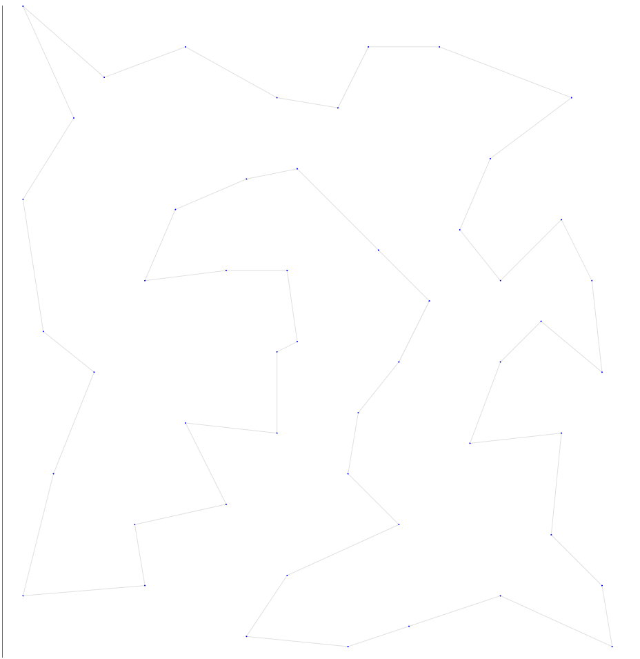
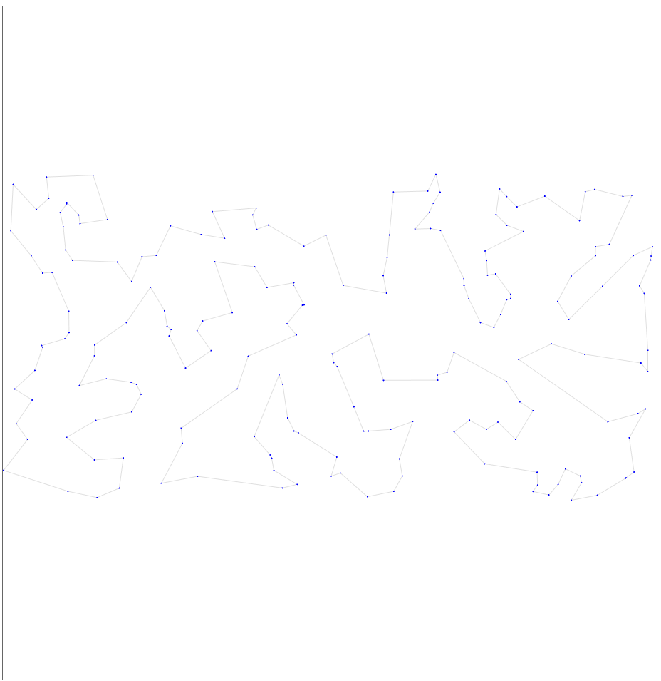
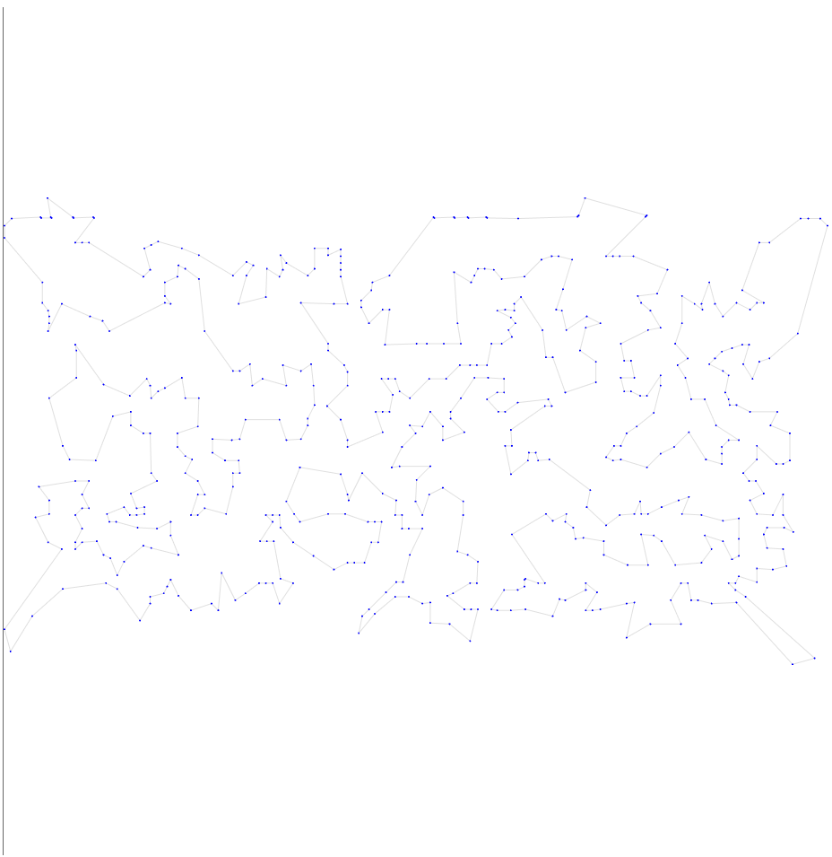
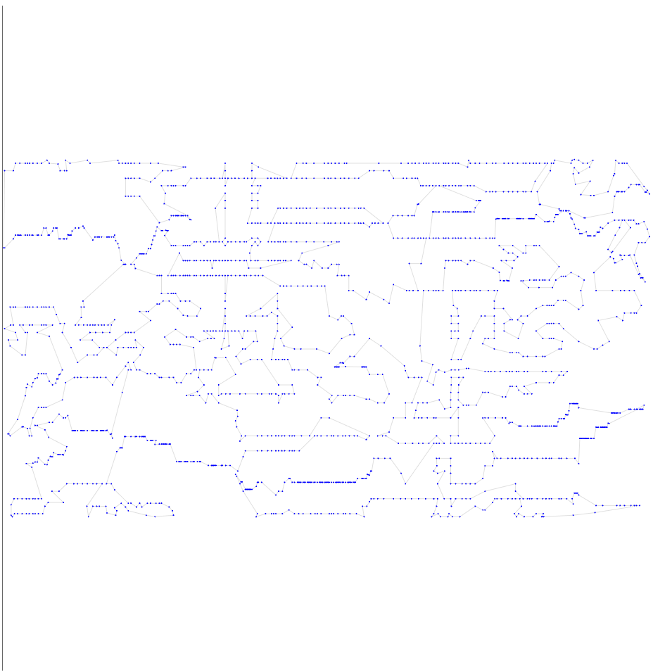
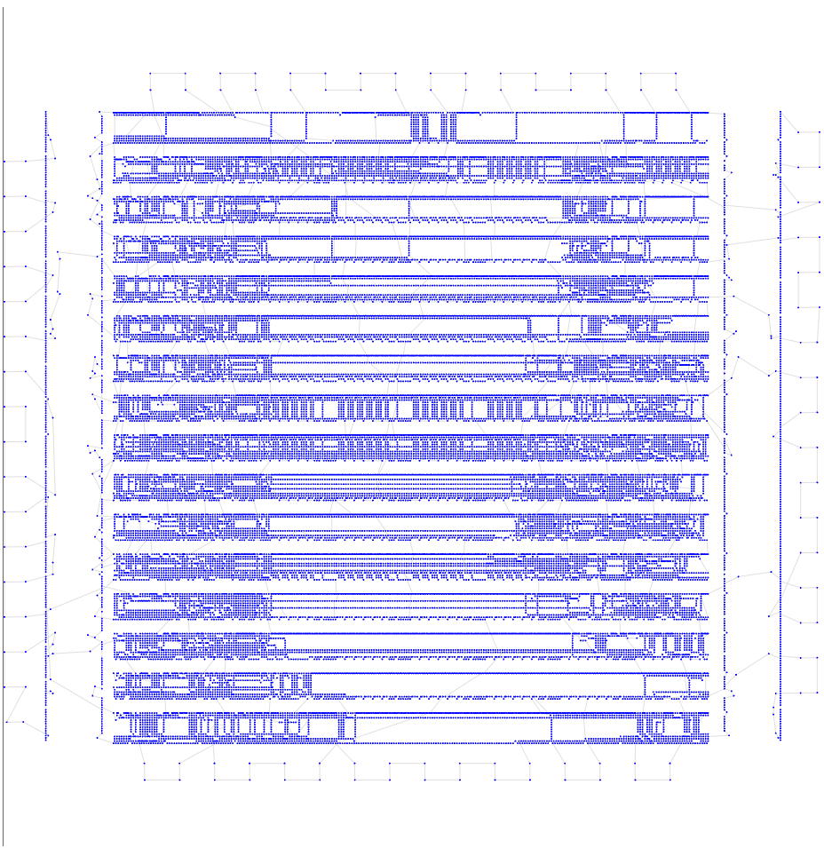

# Четвертая итерация

## Описание идеи
Попробуем двигаться в направлении идеи Life-Cycle PSO. Там есть идея Hill-Climbers, которая по сути просто пробует отдельно от других особей изменить результат - этим может быть наше готовое применение 2-opt, но одноразово.
Возьмем формулы из статьи. Только температуру сделаем угасающей как в алгоритме отжига - иначе у нас постоянно будет сильно меняться результат и ухудшение будут частыми даже в конце пути. HC в статье работает в связке, а сейчас его пробуем отдельно -> температура должна падать.

Также тяжело оценить число итераций, которое необходимо в зависимости от n, так как асимптотика работы одной итерации HC может быть разной - смотря какой кусок переворачиваем. Поэтому даем алгоритму работать 10 минут и температуру меняем соответсвующе линейно.

Число особей я сделала = 10, а не 25 как в статье, потому что много особей в данном случае заставляет алгоритм работать больше с меньшим улучшением результата (потестила на меньшем времени на разных тестах).

## Результат работы

Опишу результат на 6 тестовых выборках

| Набор данных | Длина пути | Визуализация |
| :--- | :--- | :--- |
| **tsp_51_1** | **428.87** |  |
| **tsp_100_3** | **21412.24** |  |
| **tsp_200_2** | **30821.98** |  |
| **tsp_574_1** | **38040.99** |  |
| **tsp_1889_1** | **340905.46** |  |
| **tsp_33810_1** | **76318778.45** |  |

## Итог

Все результаты кроме последнего теста улучшились, в 1 тесте пробит порог в 5 баллов.
Причем при возрастании числа точек результат стабильно ухудшается сильнее и сильнее по сравнению с постоянным 2-opt.
Но это в целом логично - где маленькое количество точек за то же время получается сделать больше итераций и время каждой итерации намного меньше.

Также на графах путей заметно видно, что они стали выбираться более оптимальнее, нежели в предыдущих попытках
