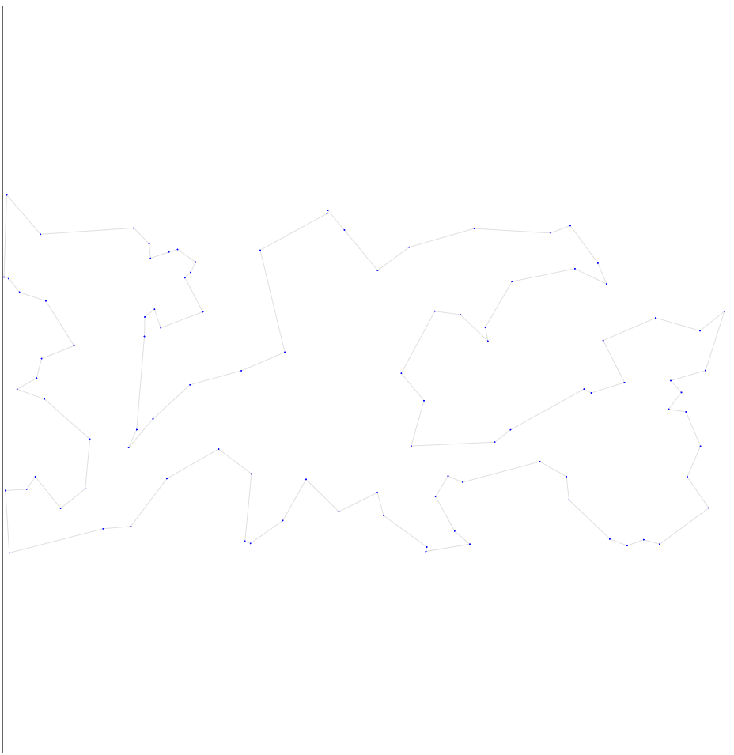
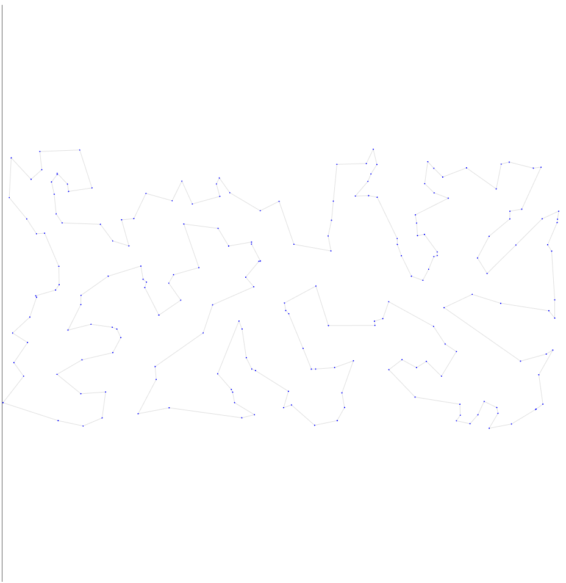
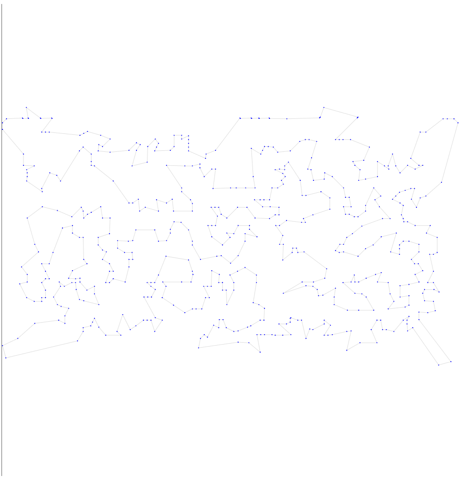
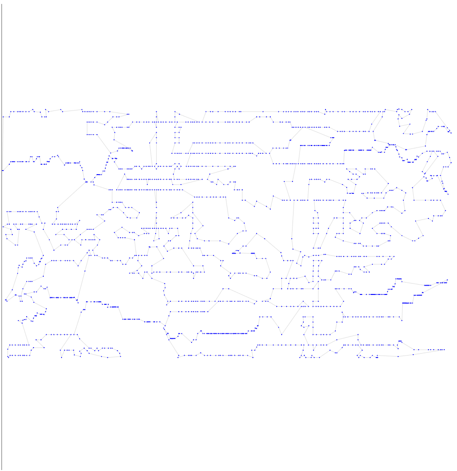
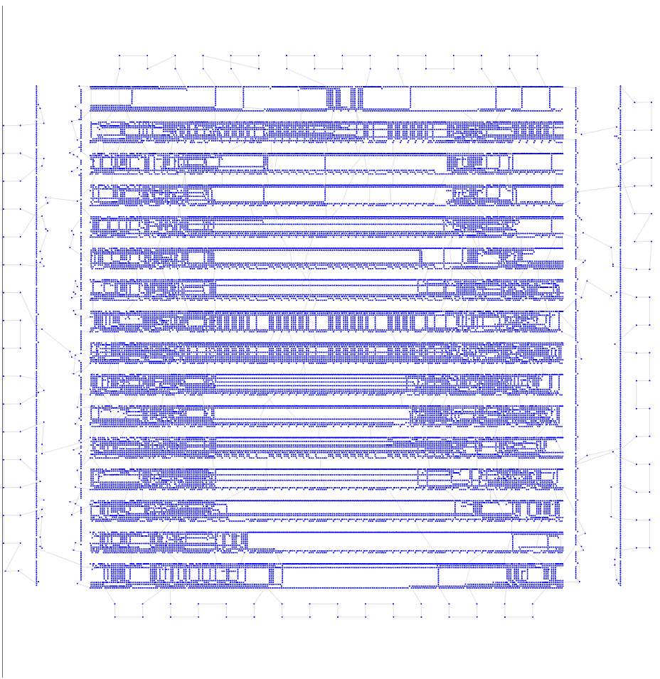

# Пятая итерация

## Описание идеи
Увеличим время работы до 30 минут + будем сохранять лучший когда либо найденный

## Результат работы

Опишу результат на 6 тестовых выборках

| Набор данных | Длина пути | Визуализация |
| :--- | :--- | :--- |
| **tsp_51_1** | **428.87** |  |
| **tsp_100_3** | **21353.71** |  |
| **tsp_200_2** | **30785.58** | |
| **tsp_574_1** | **37852.96** |  |
| **tsp_1889_1** | **340847.91** |  |
| **tsp_33810_1** | **74713723.73** | |

## Итог
Результаты улучшились, но совсем немного. Во 2,3,4 тестах близок порог к 5 баллам.
