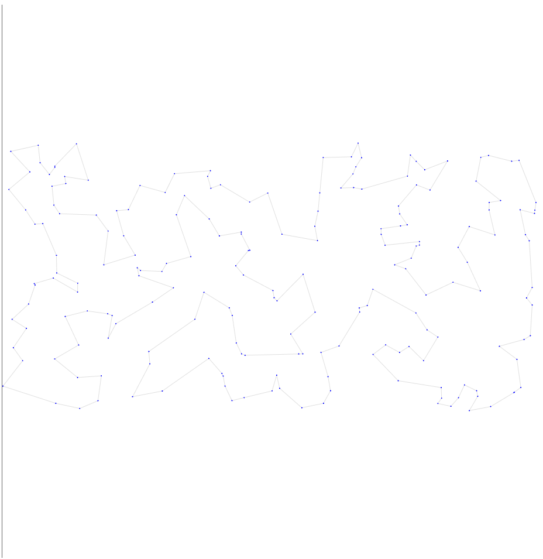
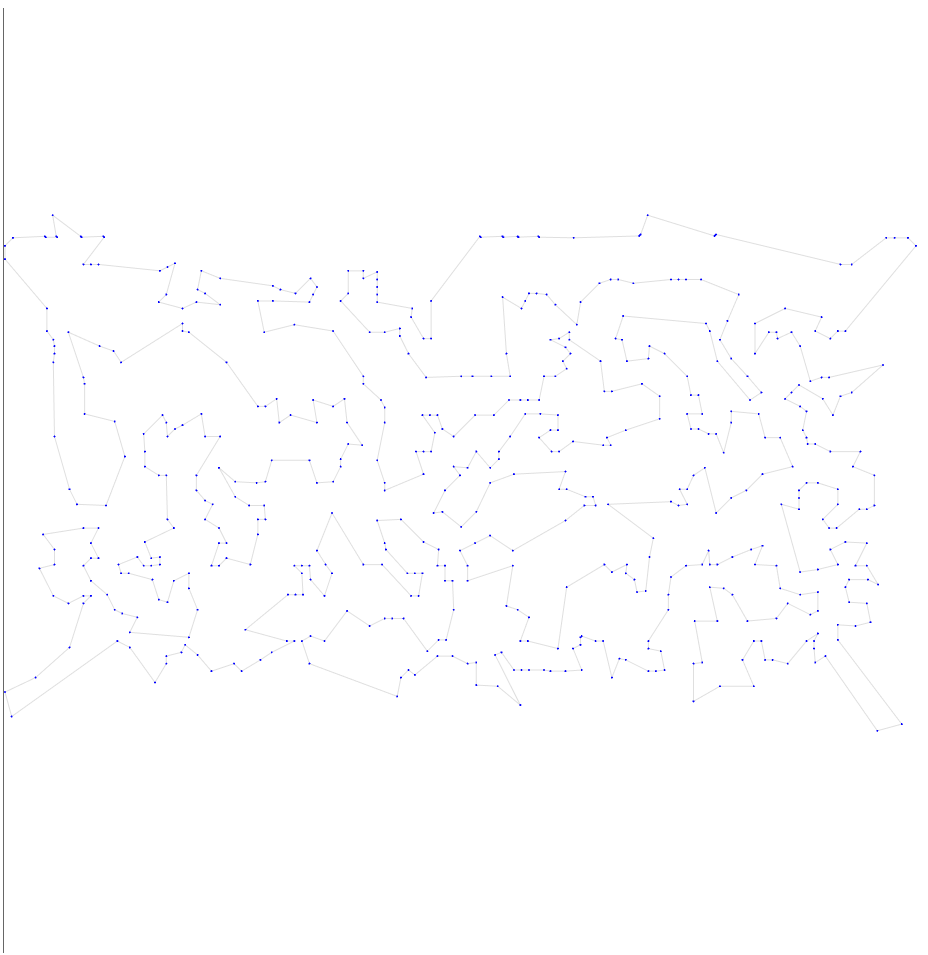
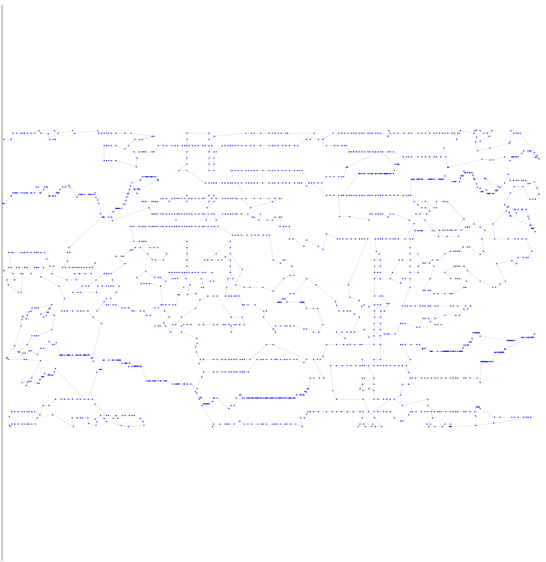
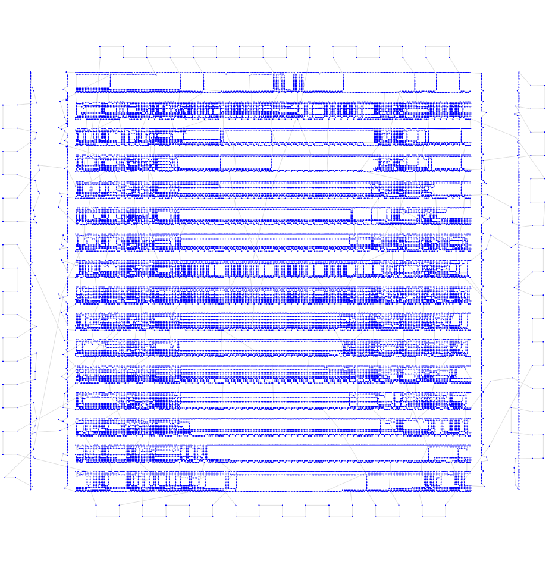

# Шестая итерация

## Описание идеи
Попробуем добавить GA в Life-cycle PSO, пока работаем 10 минут для скорости.

Так как GA работает только с вещественными данными - закодируем путь. Будем хранить строку из вещественных чисел из [0, 1]- чтобы восстановить путь надо их отсортировать и сопоставить с индексами массива. Поэтому тут появляются функции encode, decode. Ну и дальше по сути гоняем GA и при появлении нового поколения делаем на нем сколько-то итераций HC.

Немного потестировав на маленьких тестах пока выбрала внутреннее число итераций 500.
Константу MUTATION_PROB тоже надо будет отрегулировать - спросила у нейронки на какую поверхность из статьи больше похожа TSP - сказала что на Rastrigin.

Также T = 10.0 давала плохой результат, из-за того, что итераций теперь меньше и изменений было слишком много -> сделала 1.

В общем на изначальных константах, которые потом буду менять пробуем впервые совместить 2 идеи.

## Результат работы

Опишу результат на 6 тестовых выборках

| Набор данных | Длина пути | Визуализация |
| :--- | :--- | :--- |
| **tsp_51_1** | **428.87** |  |
| **tsp_100_3** | **21008.65** |  |
| **tsp_200_2** | **30650.55** |  |
| **tsp_574_1** | **40193.30** |  |
| **tsp_1889_1** | **337890.16** |  |
| **tsp_33810_1** | **78225638.45** |  |

## Итог

1 - не изменился
2,3,5 - немного улучшились
4,6 тест на удивление ухудшился