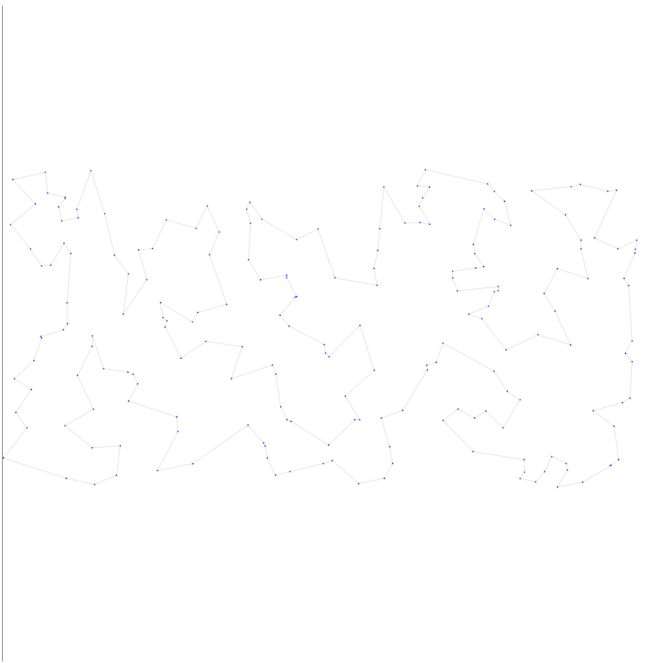
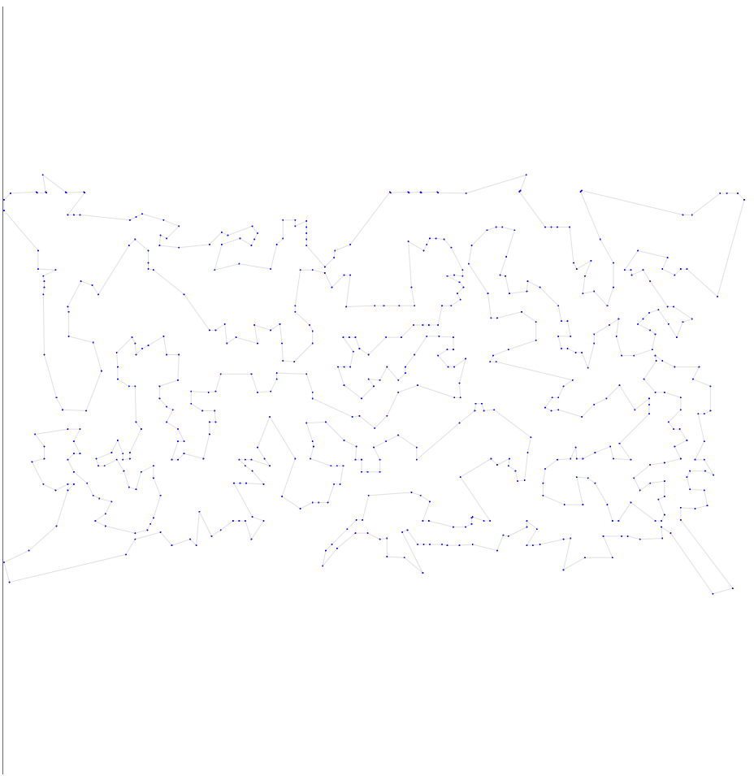
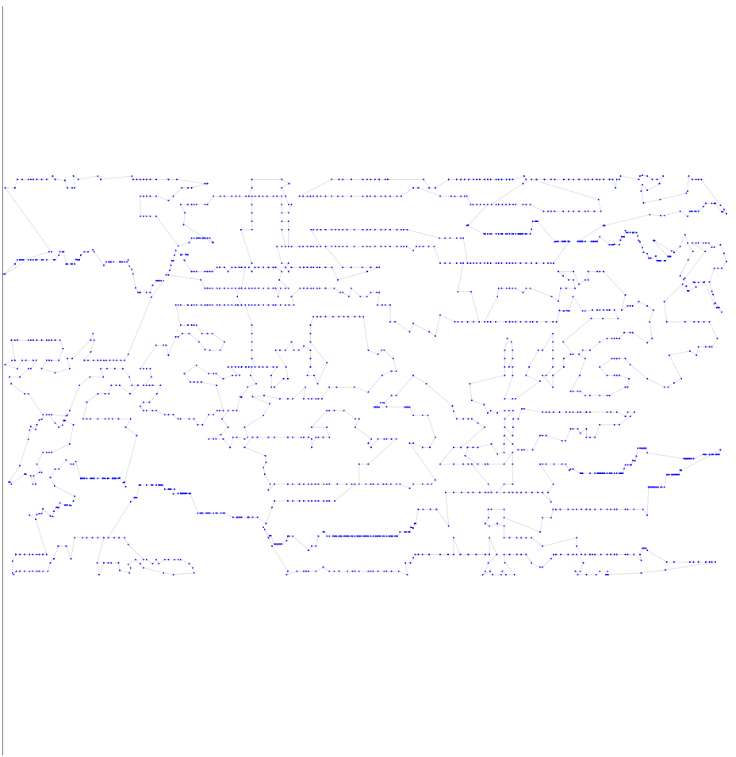
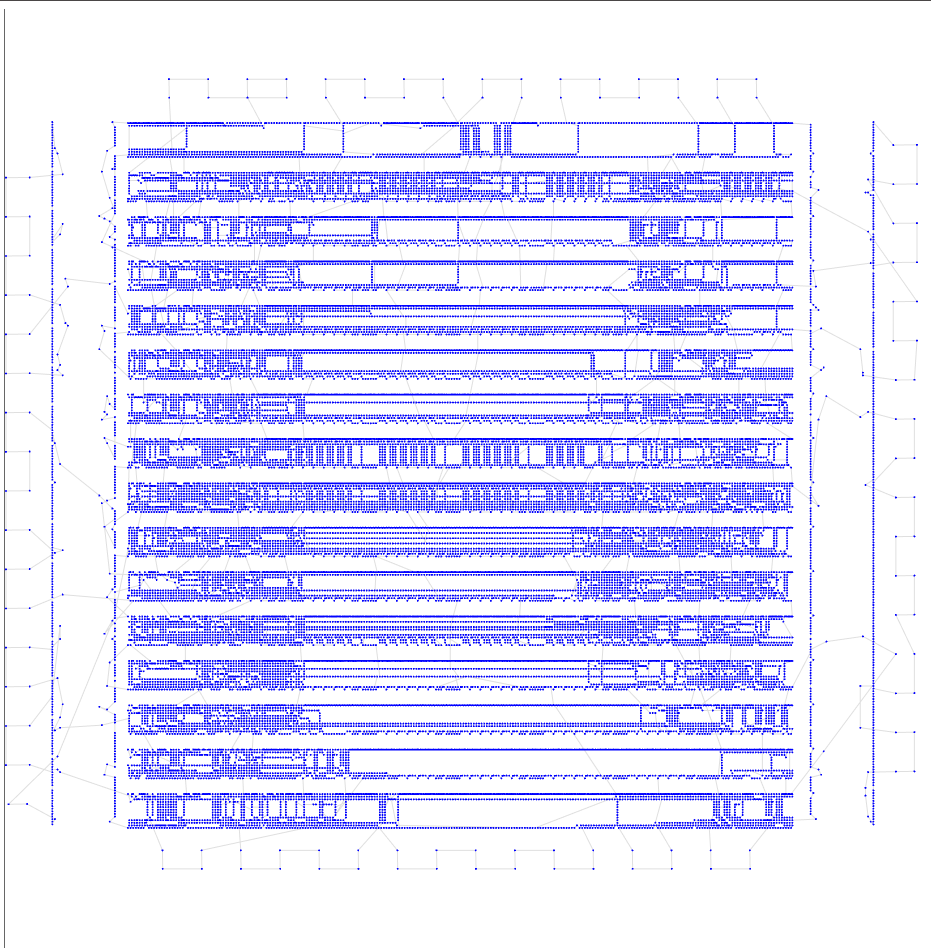

# Седьмая итерация

## Описание идеи
Меняем популяцию на 5 особей, а число итераций внутри на 2000.
В предыдущем тесте мы на мелких данных почти не изменили результат, а на больших ухудшили. Хотя вроде просто добавили GA
Значит для хорошего действия HC не хватает итераций, либо они почти все бесполезны.

## Результат работы

Опишу результат на 6 тестовых выборках

| Набор данных | Длина пути | Визуализация |
| :--- | :--- | :--- |
| **tsp_51_1** | **428.98** |  |
| **tsp_100_3** | **20881.61** |  |
| **tsp_200_2** | **30256.16** |  |
| **tsp_574_1** | **39293.59** |  |
| **tsp_1889_1** | **342005.01** |  |
| **tsp_33810_1** | **77594334.41** |  |

## Итог

все, кроме 5 теста улучшилось.

Вероятно это говорит о том, что мы начинаем не со слишком разных вариантов чтобы их перемешивать и начинать что-то хорошее