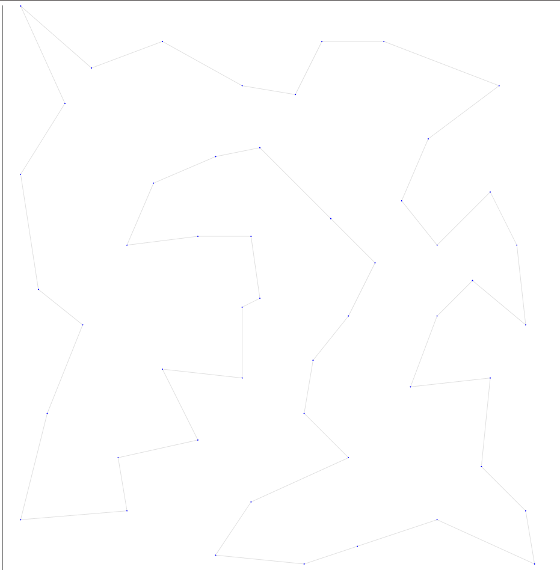
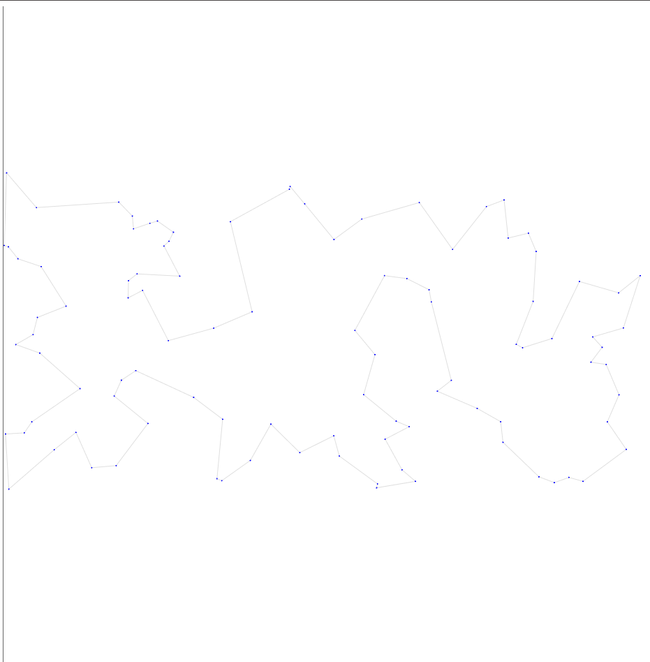
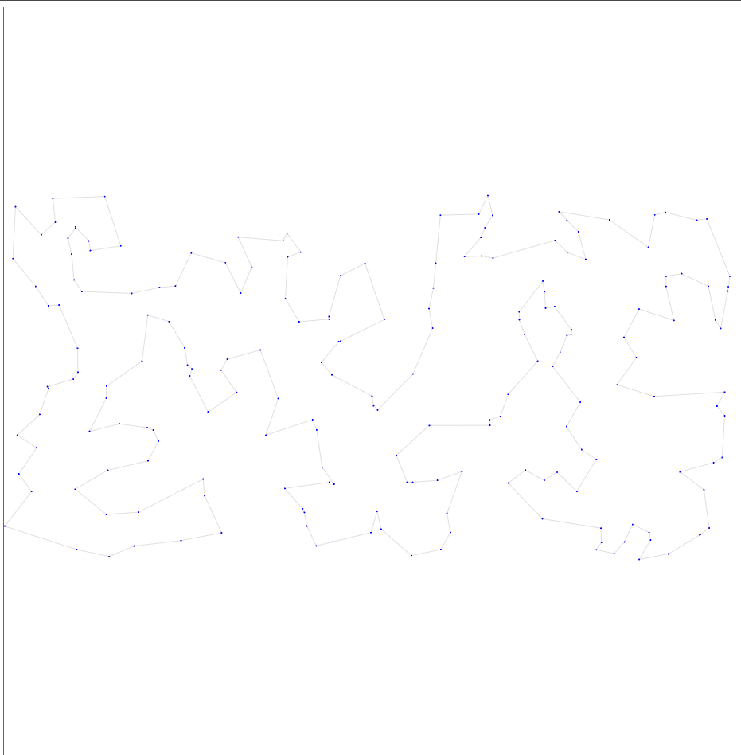
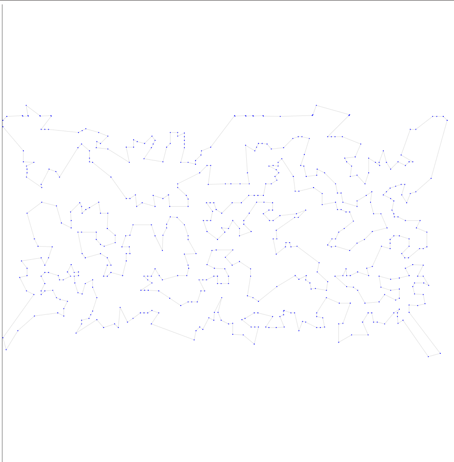
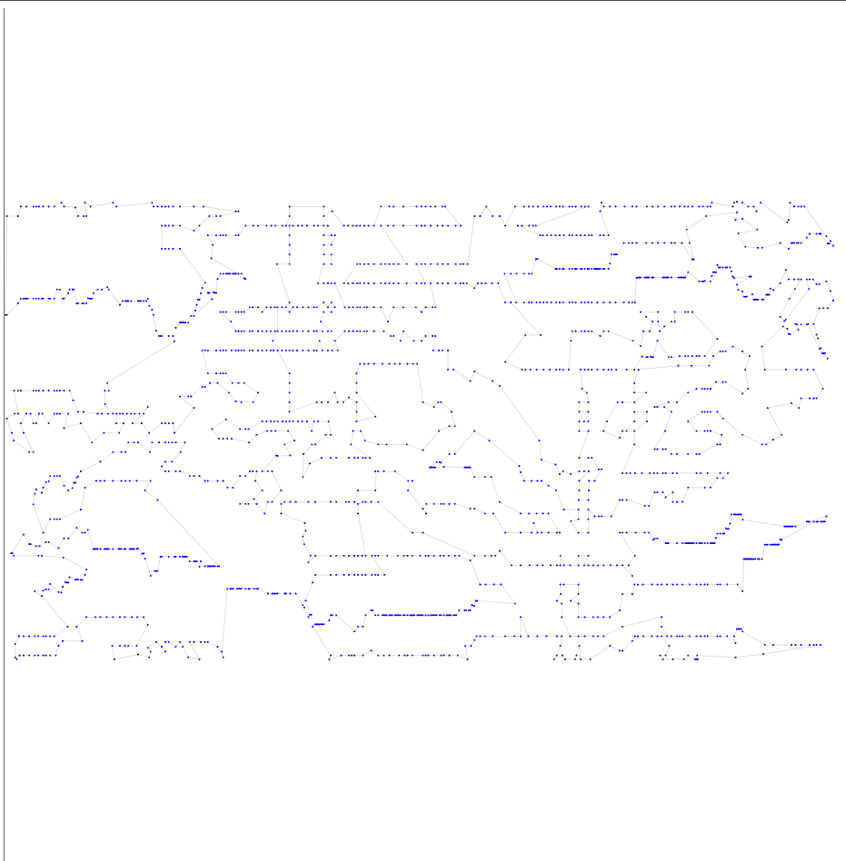
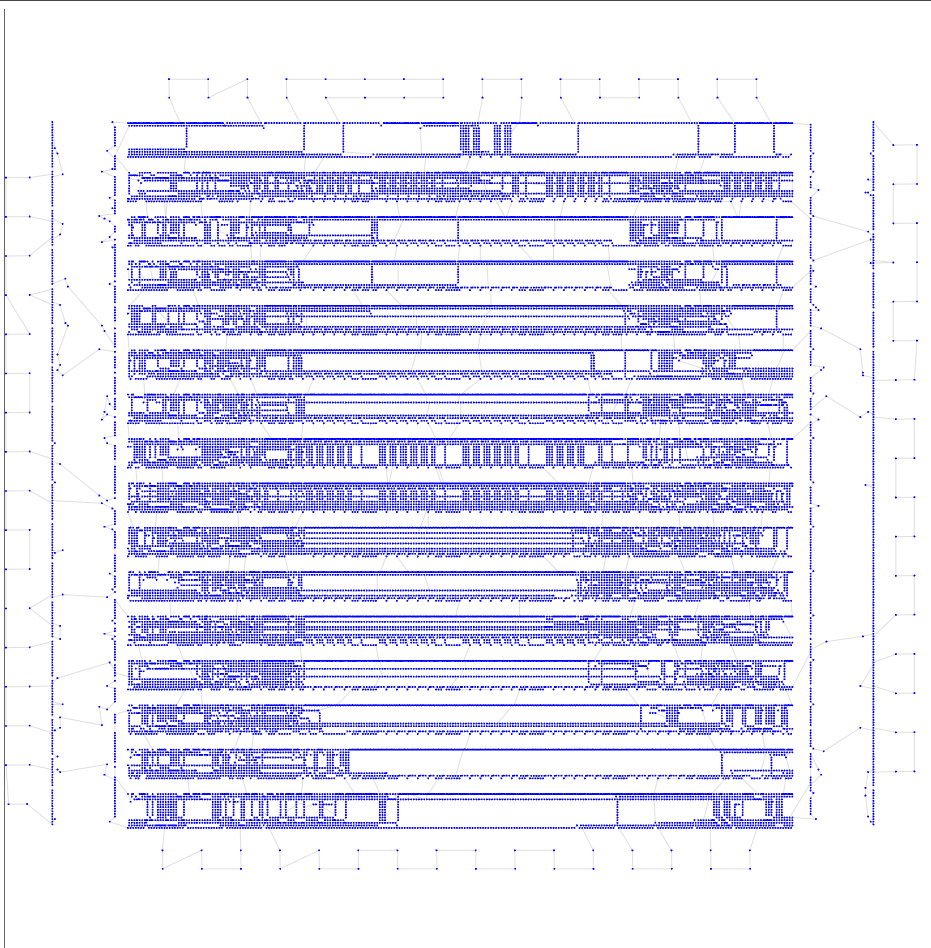

# Седьмая итерация

## Описание идеи
Пытаемся добить то что есть.
Тут в качестве первой идеи вместо проведения HC на рандомных ребрах, делаем только на соседях. Так как это нам даст более мелкое ребро, больше вероятнось, что операция будет успешна.

Ну и еще как вторую идею - на уже итоговом ответе запускаем 2-opt пока можем... чтобы из уже выбранного пути выжать максимум.

## Результат работы

Опишу результат на 6 тестовых выборках

| Набор данных | Длина пути | Визуализация |
| :--- | :--- | :--- |
| **tsp_51_1** | **428.87** |  |
| **tsp_100_3** | **20750.76** |  |
| **tsp_200_2** | **29517.54** |  |
| **tsp_574_1** | **37754.69** |  |
| **tsp_1889_1** | **334186.67** |  |
| **tsp_33810_1** | **70317935.44** |  |

## Итог

Урааа, у нас прошли в 3 тестах пороги в 5 баллов. Метрики везде улучшились.

Можно попытаться еще немного улучшить, чтобы 4 тест прошел.